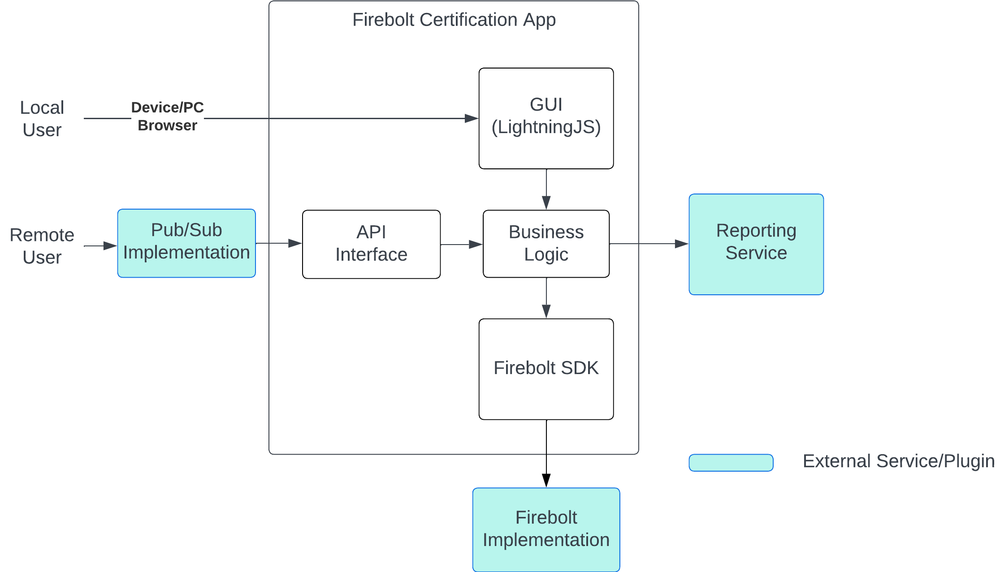

  

<h3 align="center">Firebolt Certification App</h3>

   
  
  
  

---

 

  The Firebolt Certification Application (FCA) is a lightning-based HTML5 application designed to be used on integrated devices (TVs/STBs/etc.) wishing to become compliant with the [Firebolt SDK](https://developer.rdkcentral.com/firebolt/overview/).
  
When launched, a GUI is rendered containing various options to, among others, send a Firebolt command, begin listening for a Firebolt event, and run the [Certification Suite](docs/Execution.md#certification-suite).
      

<!-- The abilities of FCA can be expanded by plugins including but not limited to
* Generic startup scripts
* API support via Pub/Sub
* Additional SDKs
* Modified behavior during the Certification Suite -->

## Table of Contents

- [Overview](#overview)
- [Architecture](#architecture)
- [Repo Contents](#repo-contents)
- [Documentation](#documentation)
- [Usage](#usage)
- [Contribution Guidelines](#contribution-guidelines)

## Overview

**Project Purpose:** The Firebolt Certification Application (FCA) is a web-based tool designed to facilitate the validation process for integrated devices, ensuring their compliance with the [Firebolt SDK](https://developer.rdkcentral.com/firebolt/overview/).

Examples of various use-cases:

  - Developers seeking to validate Firebolt SDK on integrated devices.
  - To facilitate automated Firebolt SDK compliance testing.
  - To conduct testing across multiple devices with varying Firebolt SDK versions.
  - To assess various Firebolt call inputs comprehensively.

**Features:**
  - Testing Firebolt SDK calls on integrated devices.
  - Automate Firebolt SDK tests.
  - Generate detailed compliance reports.
  - Supports Firebolt SDKs: core and manage.
  - Customizable test parameters and validation rules.
  - Deploy on various platforms with ease.
  - Graphical User Interface (GUI) for intuitive interactions.
  - Enable integration of a pub-sub communication system for remote call triggering and event handling.
  - Robust logging capabilities for monitoring and troubleshooting.

**Technology Stack:** Built with Node.js and LightningJS.

## Architecture

## Repo Contents

This repo contains these elements:

- **docs/**
  - [Documentation](./docs/Documentation.md)
- **src/**
  - A NodeJS application that acts as a Firebolt compliant app
    - Makes Firebolt calls with various params
    - Validates Firebolt responses
    - Listens for Firebolt events
    - A GUI for interacting with the app
    - A test runner for running the [Certification Suite](docs/Execution.md#certification-suite).
    - Handlers for pub-sub communications
- **test/**
  - Unit tests
- **plugins/**
  - An optional set tools that enable custom functionality to be added to FCA
    - For more info please see the [plugin documentation](docs/plugins/Plugins.md)

## Documentation

See [Documentation](./docs/Documentation.md).

## Usage

Before you begin using FCA, there are a few important steps to consider.

### API Access

By default, the API is disabled, and FCA can only be used through the GUI. To enable API access, you need to implement a PubSub plugin. Refer to our [PubSub Documentation](docs/plugins/PubSub.md) for more info.

### Pre-requisites

FCA is a Node.js application, and it relies on Node and NPM. Make sure you have Node installed; at the time of writing, Node 16.x was confirmed to work seamlessly with FCA.

**NOTE**: For newer node versions you can use `export NODE_OPTIONS=--openssl-legacy-provider` to work around any version restraints.

### Building FCA

FCA is built and compiled with [Webpack](webpack.dev.js). For more information on our Webpack configuration please see this [documentation](docs/Webpack.md).

Follow these steps to build FCA:

1. Clone the FCA repository.
2. Run `npm install`.
3. Execute `npm run build` to build the application.
4. The built application can be found in the `dist` directory, and you can access it by opening `dist/web/index.html`.

### Running FCA Locally

To run FCA on your local system, use the following steps:

1. Clone the FCA repository.
2. Run `npm install`.
3. Launch the application in your browser by executing `npm start`.
    - **NOTE**: If you see a `code: 'ERR_OSSL_EVP_UNSUPPORTED'` error you can use `export NODE_OPTIONS=--openssl-legacy-provider` to work around Node version restraints.

FCA is launched with the default host as `localhost` and port as `8081`, but these settings can be adjusted in the [Webpack](webpack.dev.js) configuration.

### Hosting FCA

FCA can be easily hosted to enable access beyond your local environment. To do so, follow these simple steps:

1. Build: build FCA using the necessary [build process](#building-fca).
2. Choose host: since FCA is built into an HTML file, you have flexibility in choosing the remote host. It can be a virtual machine (VM) or something as simple as an AWS S3 bucket exposed via CloudFront.
3. Upload: upload the contents located in the `dist/web` folder to the chosen host. While taking the entire dist folder is an option, ensuring the inclusion of everything in the web folder is essential.

## Contribution Guidelines

Welcome to the Firebolt Certification Application (FCA) project! We appreciate your interest in contributing to the development and improvement of FCA.

If you would like to contribute code to this project you can do so through GitHub by forking the repository and sending a pull request. Before RDK accepts your code into the project you must sign the RDK Contributor License Agreement (CLA).

To ensure a smooth and collaborative contribution process, please adhere to the following guidelines:

### Code Style and Standards

  - Maintain coding consistency by following the existing code style and conventions (see our [Linting Guide](Linting-Guide.md)) used in the project. This includes naming conventions, indentation, and code organization.
  - Ensure that your code changes are well-documented. Comments and documentation should be clear, concise, and follow established documentation standards (see our [Documenting Guide](docs/templates/DocumentingGuide.md)).
  - Write unit tests for new code whenever applicable. Ensure that existing tests are not broken by your changes. Testing is essential to maintain code quality and reliability.

### Pull Request (PR) Process

  - When submitting a PR, provide a clear and detailed description. Explain the implementation, changes made, and the purpose of the PR. Include any relevant context that can help reviewers understand your contribution.
  - Clearly outline the test steps you have taken to verify your changes. Ensure that your code changes do not introduce regressions and maintain the overall quality of the application.
  - All PRs must undergo a peer review process. Your PR should be reviewed by one or more team members. Reviewers will assess the quality, correctness, and adherence to coding standards.
  - After successfully passing the peer review, assign the PR to the FCA Manager for Product Owner (PO) acceptance. The FCA Manager will review the changes in the context of project goals and requirements.
  - Dev to main PRs follow a scheduled process. Every Thursday, a dev to master PR is created. After thorough testing across platforms, the PR is ready to be merged into the master branch. This ensures that changes are introduced into the master branch in a controlled and tested manner.
